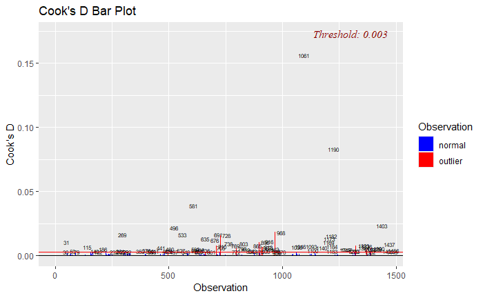

```{r setup, include=FALSE}
knitr::opts_chunk$set(echo = TRUE)
library(skimr)
library(ggplot2)
```

# Introduction

Given a dataset of home prices and features in Ames, Iowa, we set out to analyze existing factors impacting home prices and look for predictive models that can accurately predict home prices. Our first analysis (Analysis 1) is descriptive in nature: specifically, we are interested in understanding the effect that living area has on home prices in three neighborhoods in Ames. Our second analysis (Analysis 2) is predictive: we explored several linear regression models of varying size and complexity in an effort to find the best model for predicting home prices. 

## Note on Code Appendix

The assignment calls for an appendix to include our code, but because the code for our project is quite long, we have instead opted to include the entire notebook on our project github, which can be found [here](https://github.com/smu-ds-kyle/MSDS_6371_FinalProject/blob/main/Project.Rmd).

# Data Description

Our dataset includes 1,460 rows and 81 features, 43 of which are characters (categorical variables) and 38 of which are numeric variables. In addition to including the sales price for each observation, the 80 other features cover a variety of aspects of the home, including the neighborhood, living area (in square footage), the number of bedrooms, the size of the garage, the lot frontage, and many others. This is a dataset that is very popular for predictive modeling and has been used in many Kaggle competitions. 

To that end, we were also provided with a "test" dataset of 1460 observations which omits the sales price; we used this test data to validate our predictive models from Analysis 2 on Kaggle, and will include our Kaggle scores in evaluating those models.

# Analysis 1: Descriptive Analysis

## Introduction

Our first analysis examines the relationship between LogSalePrice and GrLivArea (measured in increments of 100 square feet) for homes in the NAmes, Edwards, and BrkSide neighborhoods. Specifically, the goal is to determine whether the relationship varies by neighborhood and to provide estimates with confidence intervals. 

### Transformation of SalePrice

An initial look at the data shows that the relationship between SalePrice and GrLivArea is positive and linear for all neighborhoods, with some outliers. However, because the distribution of SalePrice was right-skewed, we decided to use a log transformation of SalePrice in our analysis.


### Outliers in Edwards Neighborhood

We identified two outliers (observations 524 and 1299) in the Edwards neighborhood for which an exceptionally large living area was associated with a lower-than-expected sale price. Extensive analysis of these influential points can be found in our code appendix. 


We removed both of these outliers from the dataset. For the sake of presentation to the client, we would disclose these outliers, and note that the model is based on a dataset that doesn't include them. By removing these two data points, we increased the adjusted R2 of our model by 8%. In keeping with the idea that "all models are wrong but some are useful", we believe that the best course of action is to present this model to the company with the caveat that it should only be used with houses 3000 square feet or less.


### General Model

We fit the general model as follows:

$$\log(\text{SalePrice}) = \beta_0 + \beta_1 \times \text{GrLivArea}_{\text{BrkSide}} + \beta_2 \times \text{GrLivArea}_{\text{Edwards}} + \beta_3 \times \text{GrLivArea}_{\text{NAmes}} + \epsilon$$

## Results

As shown in the code in our appendix, the results of our model are as follows:


The results show that the relationship between GrLivArea and LogSalePrice is positive for all neighborhoods, and the p-values of all coefficients is statistically signifcant. However, the magnitude of the effect varies by neighborhood: the effect of GrLivArea on LogSalePrice is smallest in the NAmes neighborhood and largest in the Edwards neighborhood. Our neighboorhood-specific models are as follows:

### BrkSide

$$\log(\text{SalePrice}) = \beta_0 + \beta_1 \times \text{GrLivArea}$$

$$\log(\text{SalePrice}) = 10.79 + 0.000738 \times \text{GrLivArea}$$

### Edwards

$$\log(\text{SalePrice}) = (\beta_0 + \beta_{\text{Edwards}}) + \beta_2 \times \text{GrLivArea}$$

$$\log(\text{SalePrice}) = (10.79 + 0.2339) + 0.0005387 \times \text{GrLivArea}$$


### NAmes

$$\log(\text{SalePrice}) = (\beta_0 + \beta_{\text{NAmes}}) + \beta_3 \times \text{GrLivArea}$$

$$\log(\text{SalePrice}) = (10.79 + 0.6517) + 0.0003241 \times \text{GrLivArea}$$

## Assumptions

### Linearity

The plot of residuals against fitted values shows no apparent pattern, which suggests that the assumption of linearity is met.


### Normality

The Q-Q plot indicates that residuals closely follow a normal distribution, with some deviation at the extremes.


### Variance

The spread of residuals in the residuals versus fitted plot (shown above) is relatively consistent across fitted values, which suggests that the assumption of constant variance is met.

### Independence

No patterns or clustering are observed in the residuals versus fitted values plot (shown above), which that residuals are not correlated.

### Influential Points Analysis

After removing the significant outliers mentioned above (observations 524 and 1299), the Cook's D and outlier-leverage diagnostics reveal a few remaining influential points. However, these points wereless impactful than those already removed, and while they are outside the normal range, we didn't deem them extreme enough to warrant removal.


## Parameter Estimates and Model Interpretation

The model estimates suggest significant relationships between log-transformed sales price and both neighborhood and living area. The intercept 10.79 represents the average log-sale price for homes in the BrkSide neighborhood (our reference category) when the living area is zero. This is obviously not practically feasible, and it exists solely as a parameter in the model. 

The coefficients for the Edwards (0.2339) and NAmes (0.6517) neighborhoods indicate higher baseline log-sale prices compared to BrkSide. Additionally, the interaction terms for living area show positive effects on log-sale price, with the strongest effect in BrkSide (0.000738) and decreasing effects in Edwards (0.000539) and NAmes (0.000324).

Our 95% confidence intervals for the coefficients are as follows (meaning that we are 95% certain that the true coefficient is within the given range):

| Term                            | Confidence Interval (95%)                      |
|---------------------------------|-----------------------------------------------|
| Intercept                       | 10.63 and 10.95. |
| NeighborhoodEdwards             | 0.0210 and 0.4468. |
| NeighborhoodNAmes               | 0.4708 and 0.8327. |
| NeighborhoodBrkSide:GrLivArea   | 0.000611 and 0.000866. |
| NeighborhoodEdwards:GrLivArea   | 0.000432 and 0.000645. |
| NeighborhoodNAmes:GrLivArea     | 0.000264 and 0.000384. |

## Conclusion

Our analysis revealed that the relationship between living area and log-transformed sale price is positive for all neighborhoods, with the strongest effect in the BrkSide neighborhood and the weakest effect in the NAmes neighborhood. The results of our model suggest that living area is a significant predictor of sale price, and that the effect of living area on sale price varies by neighborhood.

# Analysis 2: Predictive Analysis

We now turn to the predictive analysis of home prices in Ames, Iowa. We will explore several linear regression models of varying size and complexity in an effort to find the best model for predicting home prices.

## Model 1: Simple Linear Regression

Our simplest model is a linear regression of SalePrice on GarageArea. This model seeks to predict home prices based on the size of the garage. 

### General Model 

We fit the general model as follows:

$$\log(\text{SalePrice}) = \beta_0 + \beta_1 \times \text{GarageArea} + \epsilon$$

### Results

As shown in the code in our appendix, we implemented Leave One Out Cross-Validation on our predictive models to evaluate their performance. The results of our model are as follows:


The results show that the relationship between GarageArea and LogSalePrice is positive, and the p-values for both the coefficient and intercept are statistically significant. The model has an adjusted R2 of 0.4301, which means that 43% of the variance in log-transformed sale price can be explained by the size of the garage. This is less promising than our descriptive model, but still a good start. 

The linear regression of our equation is as follows:

$$\log(\text{SalePrice}) = 11.44 + 0.001236 \times \text{GarageArea}$$

This indicates that, on average, for every additional square foot of garage area, the log of the sale price increases by 0.001236. 

### Assumptions and Influential Points Analysis

#### Linearity


The plot of residuals against fitted values shows no apparent pattern, indicating that the assumption of linearity is reasonably satisfied.

#### Normality


The Q-Q plot suggests that residuals follow a normal distribution, however some deviation is observed at the tails.

#### Variance

The spread of residuals in the residuals plot (shown) is relatively uniform across fitted values, indicating that the assumption of constant variance (homoscedasticity) is met.

#### Independence

No patterns or unusual  are visible in the residuals plot (shown above), which supports the assumption of independence.

#### Influential Points Analysis




The Cook's D and outlier-leverage plots identify a few influential points (such as observations 1061 and 1190), but they they appear to be minor violations of the assumptions and were not removed.

## Model 2: Multiple Linear Regression (GrLivArea + FullBath)

Our second model is a multiple linear regression of SalePrice on GrLivArea and FullBath. This model seeks to predict home prices based on the living area and number of full bathrooms.

### General Model

$$\log(\text{SalePrice}) = \beta_0 + \beta_1 \times \text{GrLivArea} + \beta_2 \times \text{FullBath} + \epsilon$$

### Results

As with the simple linear model, we implemented Leave One Out Cross-Validation on our first multiple linear model to evaluate its performance. The results of our model are as follows:


This results indicate that, on average, for every additional square foot of living area, the log of the sale price increases by 0.000458, and for each additional full bathroom, the log of the sale price increases by 0.1631, holding other variables constant. The intercept (11.08) represents the baseline log-sale price when both predictors are zero. This is obviously not practically feasible (as a house must have at least some living area, and it is unusual for a single family home to have no full bathrooms, though I have made do with some very small bathrooms!), thus it exists solely as a parameter in the model.

The adjusted R2 of this model is 0.5501, which means that 55% of the variance in log-transformed sale price can be explained by the size of the living area and the number of full bathrooms. This is a significant improvement over the simple linear model.

The linear regression of our equation is as follows:

$$\log(\text{SalePrice}) = 11.08 + 0.000458 \times \text{GrLivArea} + 0.1631 \times \text{FullBath}$$

### Assumptions and Influential Points Analysis

#### Linearity


The plot of residuals against fitted values shows no apparent pattern, indicating that the assumption of linearity is reasonably satisfied.

#### Normality


The Q-Q plot suggests that residuals follow a normal distribution, however some moderate deviation is observed at the tails.

#### Variance

The spread of residuals in the residuals plot (shown) is relatively uniform across fitted values, indicating that the assumption of constant variance (homoscedasticity) is met.

#### Independence

No patterns or unusual  are visible in the residuals plot (shown above), which supports the assumption of independence.

#### Influential Points Analysis


The Cook's D plot and the outlier-leverage plot identify a few points with high leverage or influence, such as observation 54. While these points do exceed the threshold for influence, we didn't think that they severely distorted the model, and we did not remove them.

## Linear Model Comparison Table

To evaluate the relative performance of our models, we have compiled a table comparing the adjusted R2, AIC, PRESS, and Kaggle scores of each model.

| Model                       | Adjusted R² | AIC           | PRESS           | Kaggle Score |
|-----------------------------|-------------|---------------|-----------------|--------------|
| Simple Linear Regression    | 0.4301      | 647.7850      | 133.0714        | 0.29097      |
| MLR: GrLivArea + FullBath   | 0.5551      | 287.6378      | 103.9207        | 0.14395      |
| MLR3                        |             |               |                 |              |
| MLR4                        |             |               |                 |              |
| MLR5                        |             |               |                 |              |
